# ADITYA-U Magnetic Field Simulations

## Overview

This repository contains my work on simulating magnetic field and equilibrium plasma behaviour in the ADITYA-U tokamak at IPR(Institute for Plasma Research), Gandhinagar, India as a part of my research project.

## Organization
The repository contains several folders as given below with brief descriptions about their function and code.

- **biot_savart_foundations:** I started by trying to simulate the magnetic fields due to 3 simple geometries. The code includes implementation of the Biot-Savart law for magnetic field calculation at a pre-defined set of points in 3D space.

  - **Cylinder:** Field due to a straight wire
  - **Solenoidal_Field:** Field due to a solenoid
  - **Toroid:** Field due to a toroidal shaped winding of wires

- **aditya-u:** Contains code simulating the toroidal magnetic field, poloidal magnetic field, and the net magnetic field in ADITYA-U with accurate physical parameters and coil positions.

  - **data_extraction:** Files to export calculated magnetic field data into paraview for visualization.
  - **equilibrium:** Scripts to calculate psi under different field configurations, assuming equilibrium conditions, plot contours obtaining plasma shape under those configurations.

## Simulation Results
### Simulation of Magnetic Fields in ADITYA-U

- Magpylib's implementation of the Biot-Savart law was used to simulate the magnetic fields in ADITYA-U. The coils were modeled as current loops, and the magnetic field was calculated at a set of points in the toroidal and poloidal planes.

- Each toroidal field(TF) coil was modeled as 2 sections of windings, both containing 6 filaments(turns) with 50kA turns, totaling about 300kA of current in a TF coil. Consistent with available data.

- Plasma current was modeled as a set of a certain number of current loops (spaced evenly along the z-axis) spanning the entire toroidal chamber.

- The net magnetic field was calculated by vector summing the magnetic fields due to each coil at all the observation points in the vacuum vessel.

- The field was calculated at 1000 points inside the toroidal chamber, and the field data was extracted for better visualization using ParaView. Streamline plots of the magnetic field in the toroidal and poloidal planes can be found in the `aditya-u/data_extraction` folder. Find the helical fields visualized below.
Here are some of the results:

  
  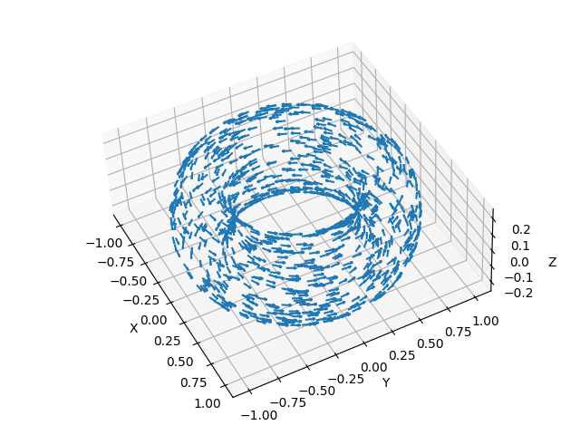

  <b>Left:</b> Toroidal Field Coil Configuration | <b>Right:</b> Toroidal Magnetic field vectors inside the confinement chamber

  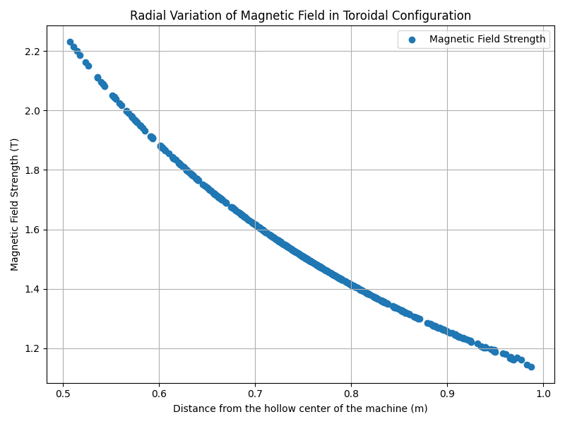

  Toroidal Field vs Radial distance(R) -- 1/R dependence is clearly inferrable

  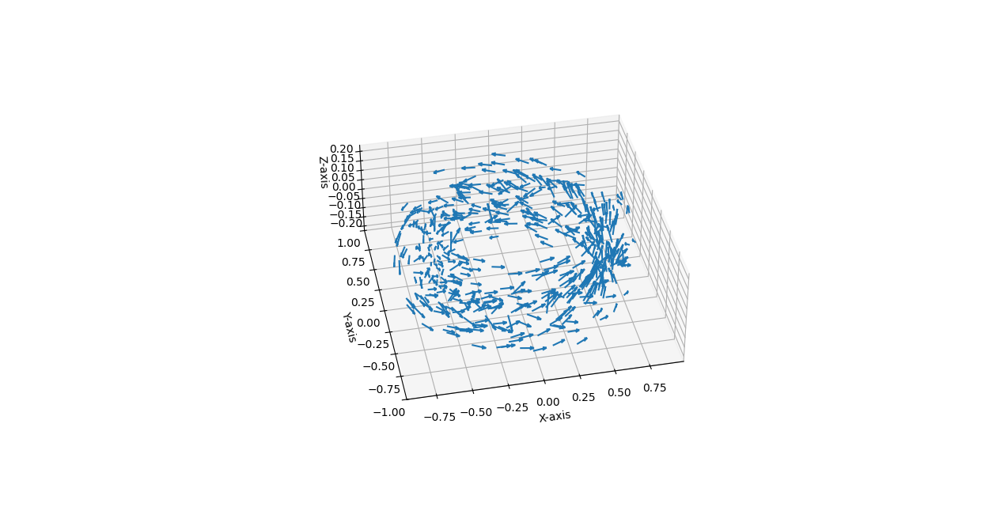
  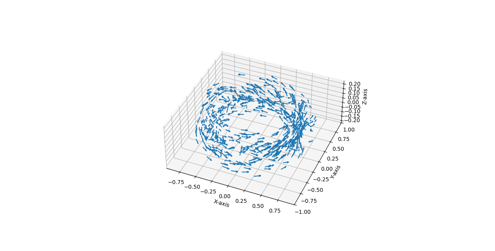

  <b>Left:</b> Net magnetic field(toroidal + poloidal) forming helical field -- View 1 | <b>Right:</b> View 2

  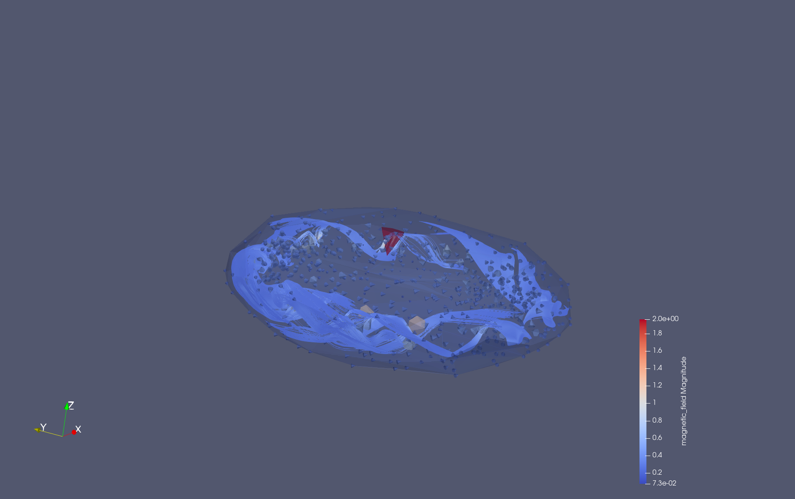
  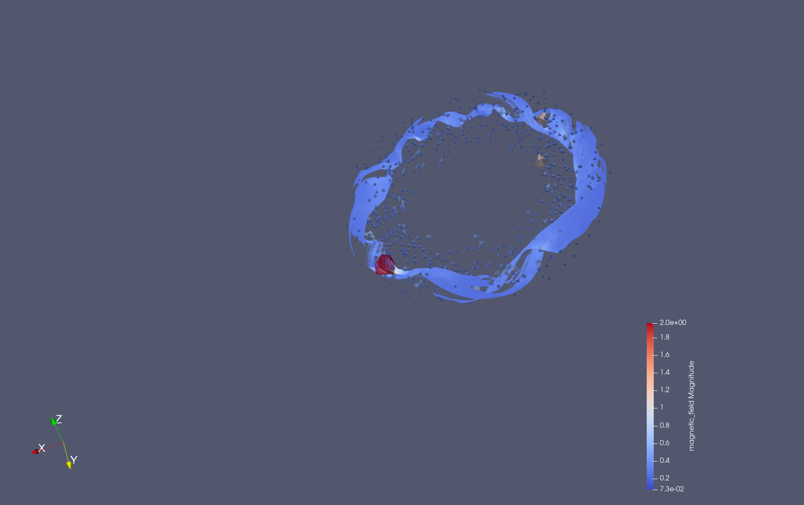

  <b>Left:</b> Streamline visualization of the net helical field -- View 1 | <b>Right:</b> View 2

### Extracted Poloidal flux function and hence the plasma shape
From the magnetic field data, the poloidal flux function was calculated using the cylindrical co-ordinate transformation of the magnetic field(expressed as the curl of a vector potential function) and axisymmetric properties of a tokamak. The plasma shape was then extracted by plotting the contour of the poloidal flux function. The plasma shape was found to be elliptical in nature, as expected.

  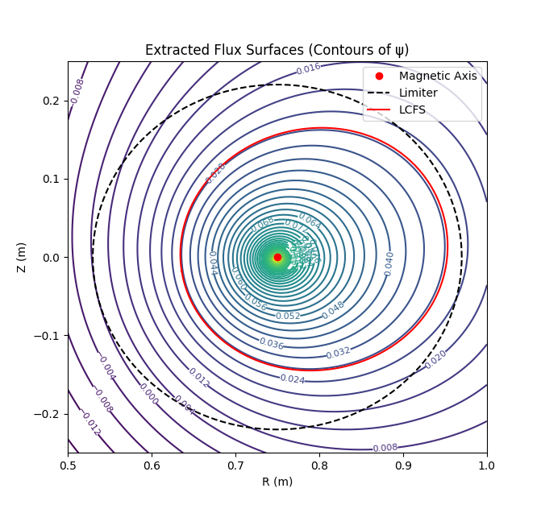
  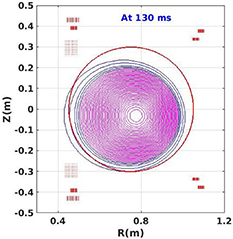

  Poloidal flux contours with limiter boudary. Plasma shape is circular. On the right is the experimentally obtained circular plasma in the actual ADITYA-U system for comparison.

  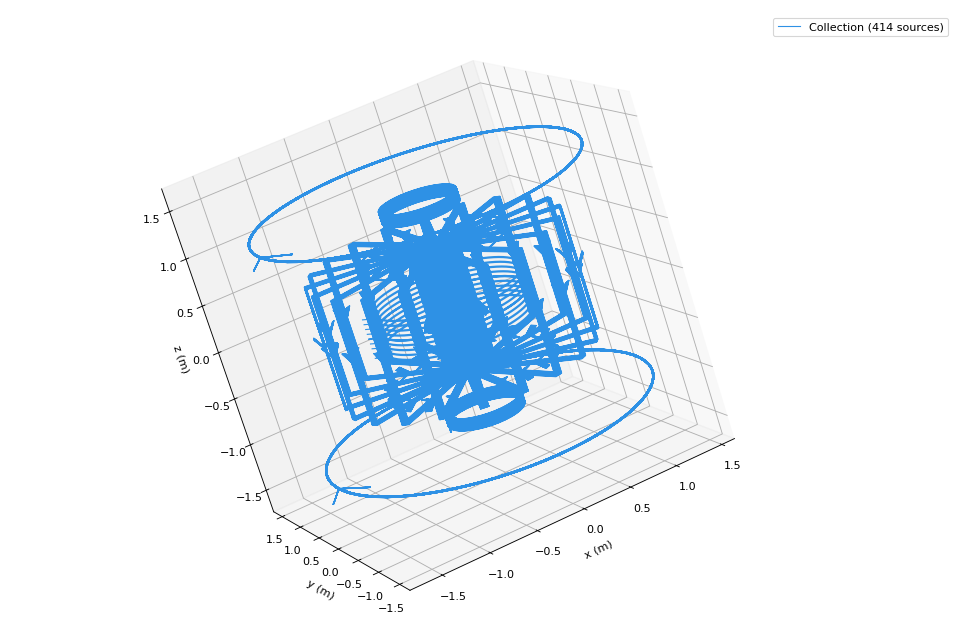

  Final configuration tf_coils + plasma_current + plasma_shaping_coils

  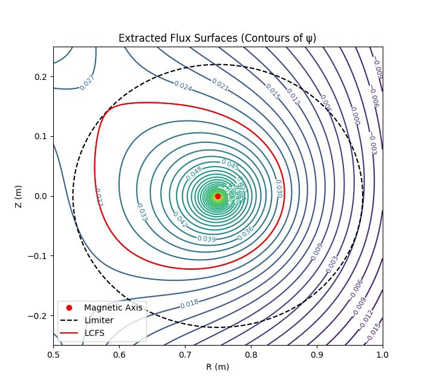
  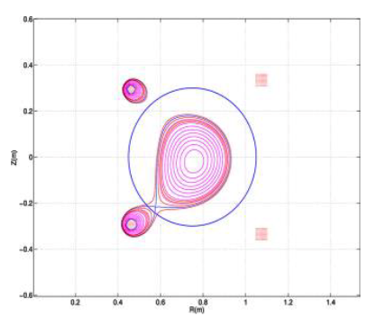

  Shaped plasma obtained. In comparison with the experimental results in the actual ADITYA-U system.

**Work in Progress** – More work to be added soon.
