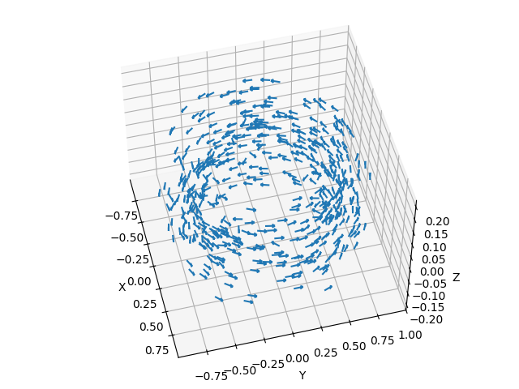

# ADITYA-U Magnetic Field Simulations

## Overview

This repository contains my work on simulating plasma behaviour and magnetic field in the ADITYA-U tokamak at IPR, Gandhinagar as a part of my research project.

## Organization
The repository contains several folders as given below with brief descriptions about their function and code.

- **early_geometry:** I started by trying to simulate the magnetic fields due to 3 simple geometries. The code inclues implementation of the biot-savart law for magnetic field calculation at a pre-defined set of points in 3d space.
    - **Cylinder:** Field due to a straight wire
    - **Solenoidal_Field:** Field due to a solenoid
    - **Toroid:** Field due to a toroidal shaped winding of wires
- **aditya-u:** Contains code simulating the toroidal magnetic field, poloidal magnetic field and the net magnetic field in ADITYA-U with accurate physical parameters and coil positions.
- **freegs_sim:** Contains code using FreeGS library to solve the Grad-Shafranov equation for realistic coil positions and geometries.

## Simulation Results
### Simulation of Magnetic fields in ADITYA-U
--> Magpylib's implementation of Biot-Savart law was used to simulate the magnetic fields in ADITYA-U. The coils were modelled as current loops and the magnetic field was calculated at a set of points in the toroidal and poloidal planes.

--> Each toroidal field coil(tf coil) was modeled as a set of 6 current loops carrying a current of 7500kA per loop hence 45kA of current runs through one tf coil.

-->Plasma current was modeled as a set of 8 current loops(spaced evenly along z-axis) spanning the entire toroidal chamber with a current of 10kA per loop.

-->The net magnetic field was calculated by summing the magnetic fields due to each coil at each point in the toroidal and poloidal planes.

-->The field was calculated at 1000 points inside the toroidal chamber and the field data was extracted for better visualization using paraview. You may find the streamline plots of the magnetic field in the toroidal and poloidal planes in the aditya-u folder.

Here are some of the results:

Work in Progress -- More work to be added soon.

