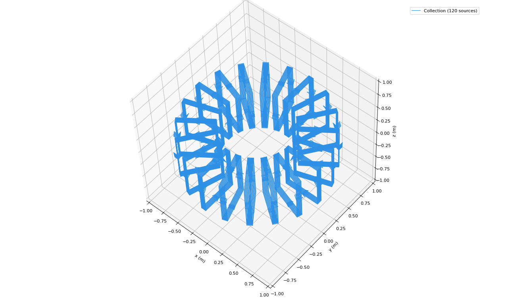
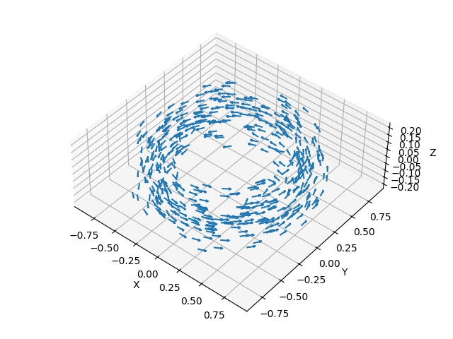
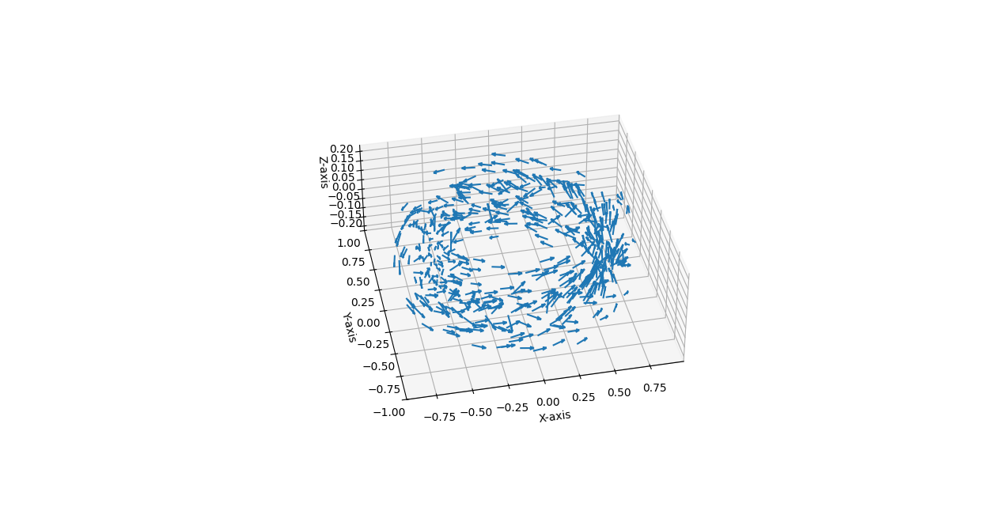
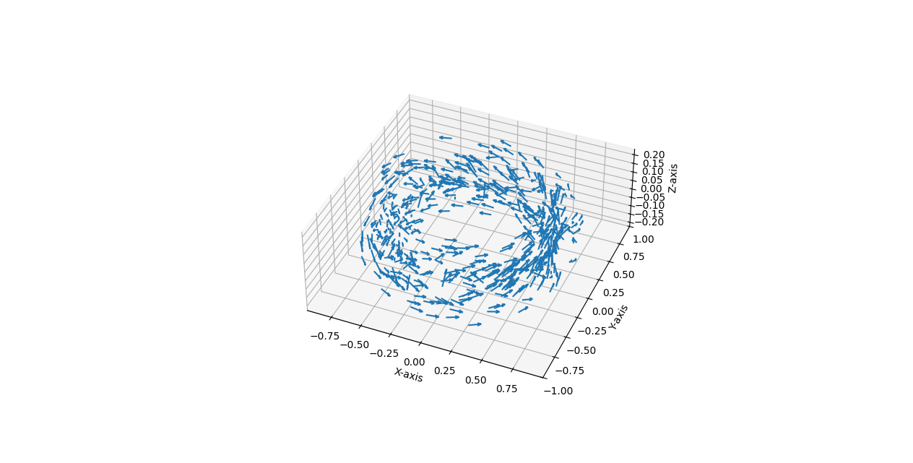
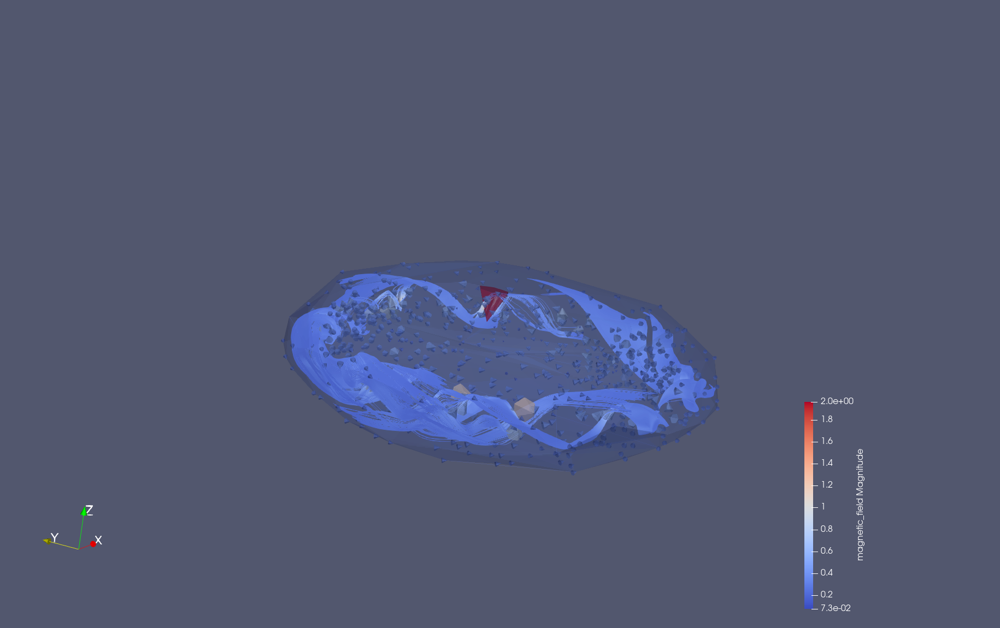
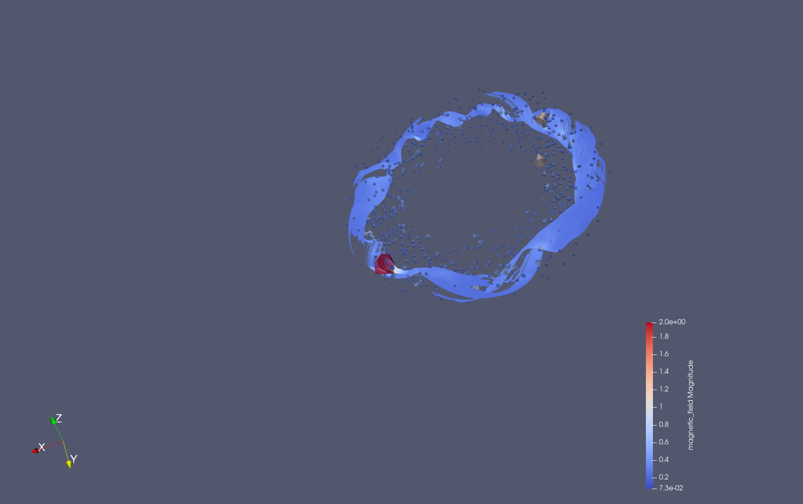

# ADITYA-U Magnetic Field Simulations

## Overview

This repository contains my work on simulating plasma behaviour and magnetic field in the ADITYA-U tokamak at IPR, Gandhinagar as a part of my research project.

## Organization
The repository contains several folders as given below with brief descriptions about their function and code.

- **biot_savart_foundations:** I started by trying to simulate the magnetic fields due to 3 simple geometries. The code includes implementation of the Biot-Savart law for magnetic field calculation at a pre-defined set of points in 3D space.
    - **Cylinder:** Field due to a straight wire
    - **Solenoidal_Field:** Field due to a solenoid
    - **Toroid:** Field due to a toroidal shaped winding of wires
- **aditya-u:** Contains code simulating the toroidal magnetic field, poloidal magnetic field, and the net magnetic field in ADITYA-U with accurate physical parameters and coil positions.
- **plasma_equilibrium:** Contains code using the FreeGS library to solve the Grad-Shafranov equation for realistic coil positions and geometries.

## Simulation Results
### Simulation of Magnetic Fields in ADITYA-U

- Magpylib's implementation of the Biot-Savart law was used to simulate the magnetic fields in ADITYA-U. The coils were modeled as current loops, and the magnetic field was calculated at a set of points in the toroidal and poloidal planes.
- Each toroidal field(TF) coil was modeled as 2 sections of windings, both containing 6 filaments(turns) with 4.166kA of current running through each turn leading to ~50kA of current for 1 TF coil.
- Plasma current was modeled as a set of 8 current loops (spaced evenly along the z-axis) spanning the entire toroidal chamber with a current of 10 kA per loop.
- The net magnetic field was calculated by summing the magnetic fields due to each coil at each point in the toroidal and poloidal planes.
- The field was calculated at 1000 points inside the toroidal chamber, and the field data was extracted for better visualization using ParaView. Streamline plots of the magnetic field in the toroidal and poloidal planes can be found in the `aditya-u_fields/data_extraction` folder. Find the helical fields visualized below.
Here are some of the results:

  
  

  
  

  
  

**Work in Progress** – More work to be added soon.